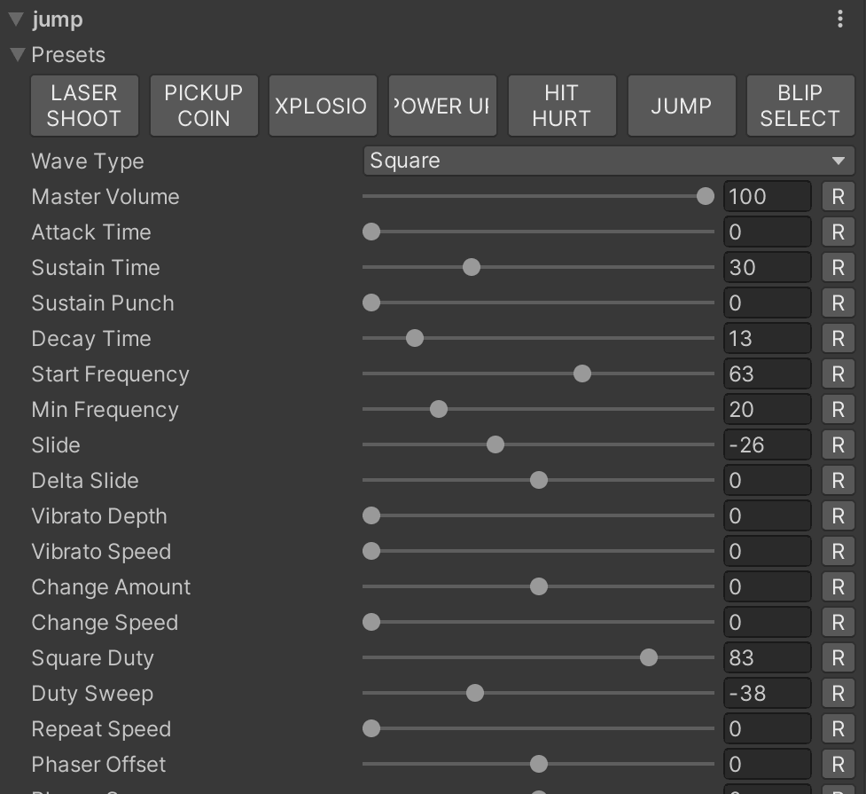



TinySynth is a direct fork of [usfxr](https://github.com/grapefrukt/usfxr). I had to rename it because I couldn't
remember how to spell usfxr.

TinySynth lets you quickly generate placeholder (or permanent, I don't judge) sound effects right inside the Unity
editor.

This is achieved by being essentially a tiny synthesizer tailored for making bleeps and bloops suitable for games, it
comes with several presets to quickly generate a starting point that can be tweaked further.

Usage
------------
Add a the `TinySynthPlayer` component to an object in your scene, the main camera is a good spot to put it.

Now, in any MonoBehaviour you wish to play a sound effect, add a public `TinySynthSound` field:

	public TinySynthSound sfxJump;

This will now get a nice property drawer in the editor where you can tweak its properties or apply any of the provided
presets.

To play this sound effect, call the static function on `TinySynthPlayer`:

    TinySynthPlayer.Play(sfxJump);

That's it!

Caching
------------

It takes a few milliseconds to generate a sound effect, to keep things snappy they are cached once generated. If you
wish to pre-cache your effects call:

    TinySynthPlayer.PreCache(this);

This can be done from any MonoBehaviour and will cache all effects across every behaviour despite only taking a
reference to one.

Installation
------------
Add [this repository](https://github.com/grapefrukt/usfxr.git) as a package in
the [Unity Package Manager](https://docs.unity3d.com/2019.3/Documentation/Manual/upm-ui-giturl.html).

Todo
------------

- [ ] Figure out a way to hide parameters that do nothing for the current configuration (ie duty cycle for non square
  waves)
- [ ] Mutations do not work yet
- [x] Add locking of parameters when mutating
- [x] Improve Editor UI implementation (it's not very good)
- [x] Cache sounds before they are played (avoids latency spikes)
- [x] Add Undo/redo history
- [x] Allow for playback of more than one effect at a time
